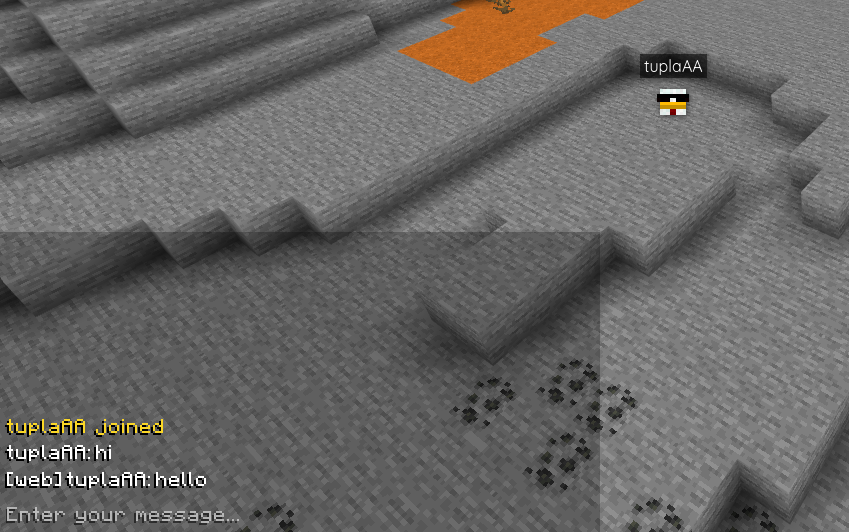
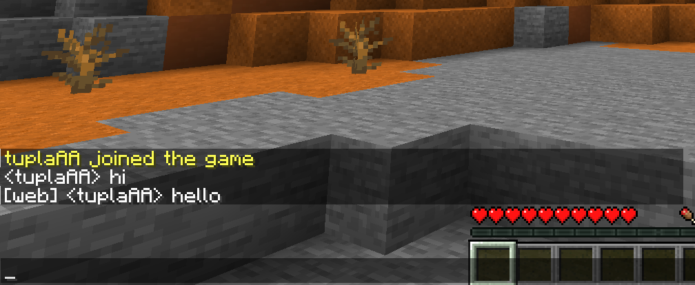

# Auth/BlueMap/Chat

Web chat integration for BlueMap. Requires the BlueMap-Auth integration plugin for extra functionality.

## Images




## Configuration

The `ip` and `port` are the same as with the main projects in this repository. The default port is `8800`.

If `read-auth` is `true`, chat is only visible to logged-in users.  
If `read-only` is `true`, users can not send any messages from web.

## Endpoints

*This section is only relevant for advanced usage.*

- `GET /stream` returns an event stream of chat messages as JSON objects that look like the following
```typescript
type Message = {
    uuid: string;
    username: string;
} & ({
    type: "chat" | "webchat" | "death";
    message: string;
} | {
    type: "join" | "leave";
})
```
- `POST /send` is used to send a web chat message. The body should be a JSON object with a `message` field.
Message should be less than 256 characters long.

## Nginx configuration

See [the BlueMap Integration example Nginx configuration](https://github.com/Chicken/Auth/tree/master/BlueMap/Integration#example-nginx).
And add the following in your application layer next to the Integration configuration:

```nginx
  location /addons/chat/ {
    proxy_pass http://127.0.0.1:8800/;
    proxy_buffering off;
  }
```
